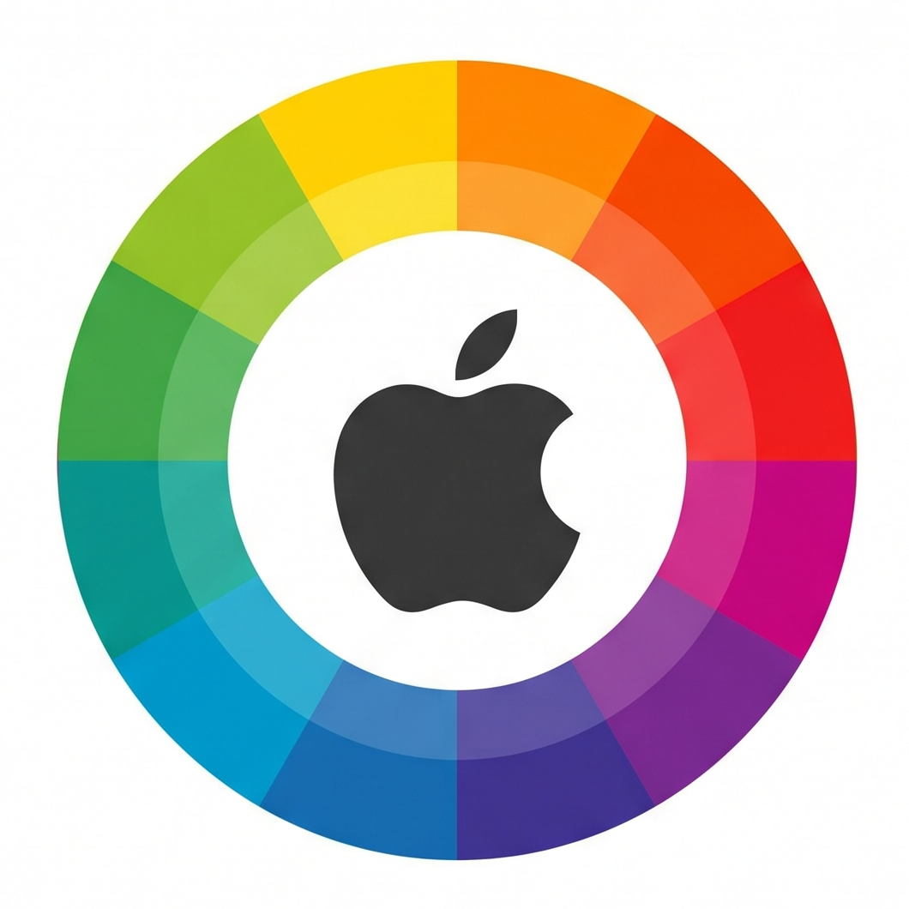

<div align="center">



# Paint for macOS

**A faithful re-creation of Microsoft Paint, built natively for macOS with Swift & AppKit.**

No web view, no Electron, no external dependencies — just a single native `.app` powered by Cocoa drawing.

</div>

---

## Overview

**Paint for macOS** brings the classic Windows Paint experience to the Mac. It reproduces the Windows 7/10‑style **Ribbon** interface, the full tool set, the shape library, the color palette, and the editing workflow you remember — implemented from scratch on top of AppKit's `NSView`, `NSBitmapImageRep`, and `NSBezierPath`.

The whole application is roughly **4,600 lines of Swift across 14 files**, with **23 automated tests** and a headless self‑test harness that renders the drawing engine and UI to PNG for visual verification.

> Interface language: **Traditional Chinese (繁體中文)**, mirroring the localized Windows Paint ribbon labels.

---

## Screenshots

| Ribbon UI | Drawing engine (tools & shapes) | Transparency |
|---|---|---|
| The full Home tab: Clipboard · Image · Tools · Tolerance · Brushes · Shapes · Size · Colors | Pencil, 9 brushes, 23 shapes, fills | Transparent color punches real alpha holes (checkerboard) |

*(Generate fresh screenshots any time with the built‑in render modes — see [Headless tooling](#headless-tooling).)*

---

## Features

### Tools
- **Pencil** — 1px freehand drawing
- **Brushes (9 styles)** — round, calligraphy 1 & 2, airbrush, oil, crayon, marker, natural pencil, watercolour, each with its own stroke algorithm
- **Eraser** — paints with the background color (or **transparent**, erasing to real alpha)
- **Fill with color (paint bucket)** — scanline flood fill with an adjustable **tolerance slider** (Windows 11 style): raise it to fill similar colors together
- **Color picker (eyedropper)** — sample any pixel into Color 1 / Color 2
- **Text** — click to type, rendered into the bitmap
- **Magnifier** — click to zoom in (right‑click to zoom out)

### Shapes (23)
Line, curve, ellipse, rectangle, rounded rectangle, polygon, triangle, right triangle, diamond, pentagon, hexagon, four arrows (←↑→↓), 4/5/6‑point stars, rectangular / elliptical / cloud callouts, heart, and lightning bolt — each with independent **outline** and **fill** styles.

### Selection & Image editing
- Rectangular **and** free‑form selection
- Move selections, plus **8 resize handles** to scale them
- Cut / Copy / Paste / Delete via the system pasteboard
- Crop to selection
- Resize / rescale the canvas
- Rotate 90° / 180°, flip horizontal / vertical

### Colors
- 20‑swatch standard Paint palette + Color 1 / Color 2
- **Transparent color** swatch — draw, fill, or erase to genuine transparency
- "Edit colors" opens the native macOS color panel; picked colors are remembered

### Transparency (alpha)
- A dedicated **transparent color** lets the bucket, pencil, brush, eraser, and shapes clear pixels to true alpha 0 via `.clear` compositing
- The canvas renders a **checkerboard** behind transparent pixels so you can see through them
- Opaque tools correctly paint **over** transparent regions
- **PNG export preserves the alpha channel** — transparent areas stay transparent in the saved file

### View
- Zoom **25%–800%** in 25% steps — the View‑tab Zoom In/Out buttons and the bottom‑right `−` / `+` controls share identical stepping logic
- Live zoom slider and percentage in the status bar
- Gridlines (at high zoom), rulers toggle, status bar toggle, full‑screen

### File
- New / Open / Save / Save As (**PNG, JPEG, BMP, GIF, TIFF**)
- Print
- **Drag & drop** an image file onto the canvas to load it (with a blue drop highlight)
- Image properties dialog
- Unsaved‑changes confirmation

### Polish
- Light‑appearance window matching Paint's look (readable in any system theme)
- Custom **retina‑crisp tool cursors** drawn as vectors — a yellow segmented pencil, a tilting paint bucket with a pouring drop, a 3D pink eraser, a light‑blue eyedropper, a magnifier with a `+`, and precise crosshairs
- Ribbon laid out on a unified content band with a single type scale for tidy alignment

---

## Requirements

- **macOS 12 (Monterey)** or later
- For building: **Xcode command‑line tools** with **Swift 5.9+** (developed against Swift 6.2)

---

## Build & Run

### Quick start (bundled `.app`)

```bash
git clone https://github.com/walush2023/macos-paint.git
cd macos-paint
./build_app.sh      # compiles, generates the icon, and packages Paint.app
open Paint.app
```

`build_app.sh` compiles the Swift Package, regenerates `AppIcon.icns` from `icon.png` (via `sips` + `iconutil`), and assembles `Paint.app` with its `Info.plist` and icon.

### Run directly with SwiftPM

```bash
swift build
.build/debug/Paint
```

---

## Testing

The app ships with a self‑contained test harness — no XCTest target required. Each mode is a command‑line flag on the same binary.

```bash
# 23 functional unit tests (history, flood fill, tolerance, selection,
# rotate/flip, resize, file round‑trip, zoom steps, cursors, transparency …)
.build/debug/Paint --unit-test

# Render every tool & shape into a 4×4 grid PNG (drawing‑engine check)
.build/debug/Paint --test out.png

# Render the full main window offscreen to PNG (UI‑layout check)
.build/debug/Paint --render-window ui.png
```

### Headless tooling

Extra diagnostic render modes used during development:

| Flag | Purpose |
|---|---|
| `--unit-test` | Run all 23 assertions; exits non‑zero on failure |
| `--test <out.png>` | Draw all tools/shapes into a labelled grid |
| `--render-window <out.png>` | Offscreen snapshot of the whole window |
| `--cursor-preview <out.png>` | Enlarged preview of every tool cursor (with hot‑spots) |
| `--drop-test  <out.png>` | Simulate drag‑and‑drop image loading end‑to‑end |
| `--transparency-demo <view.png> <export.png>` | Punch a transparent hole and verify PNG alpha is preserved |

---

## Architecture

A single SwiftPM executable target. Key types:

| File | Responsibility |
|---|---|
| `main.swift` | Entry point + CLI test/render mode dispatch |
| `AppDelegate.swift` | App lifecycle, main menu, dock icon |
| `MainWindowController.swift` | Window layout, file/edit/image/view actions, status bar |
| `TabBarView.swift` | File / Home / View ribbon tabs |
| `RibbonView.swift` | The whole ribbon: groups, buttons, palette, tolerance slider |
| `CanvasView.swift` | The drawing surface — `NSBitmapImageRep` backing, mouse handling, flood fill, selection, undo/redo, drag‑and‑drop, transparency |
| `Brushes.swift` | The 9 brush stroke algorithms |
| `Shapes.swift` | `NSBezierPath` geometry for all 23 shapes |
| `Cursors.swift` | Vector, retina‑rendered tool cursors |
| `Dialogs.swift` | Color picker & resize sheets |
| `Models.swift` | Shared `PaintState`, enums, palette, undo `History`, transparent‑color helpers |
| `SelfTest.swift` / `UISnapshot.swift` / `UnitTests.swift` | Headless test & render harnesses |

### Design notes
- **Drawing model:** a bottom‑left‑origin `NSBitmapImageRep` is the single source of truth; an overlay `NSImage` previews shapes/selections without committing them.
- **Coordinate system:** the canvas `bounds` always equals the native pixel size while its `frame` is the zoomed size, so every mouse coordinate maps 1:1 to a pixel regardless of zoom.
- **Undo/redo:** snapshot‑based `History` (up to 50 steps).
- **Flood fill:** scanline fill with a `visited` array (prevents re‑scan loops under non‑zero tolerance) and RGBA distance matching.
- **Transparency:** transparent drawing uses `.clear` compositing; the canvas composites the bitmap with explicit `.sourceOver` over a checkerboard so alpha reads correctly and PNG export keeps it.

---

## License

Released for educational and personal use. "Microsoft Paint" and "Windows" are trademarks of Microsoft Corporation; this project is an independent re‑creation and is not affiliated with or endorsed by Microsoft.

---

<div align="center">
Built with Swift &amp; AppKit · 🎨
</div>
